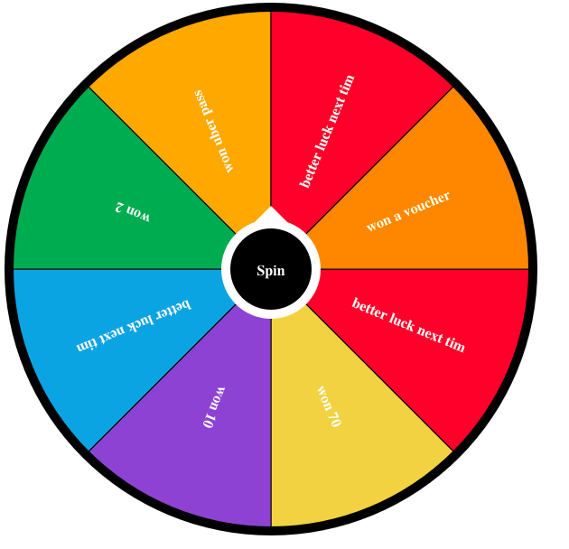
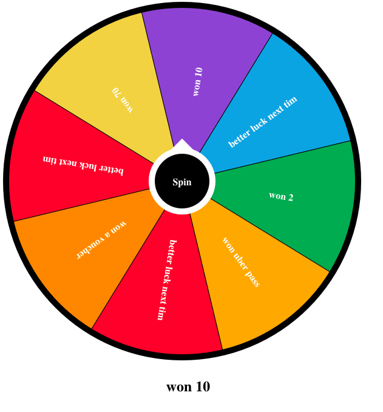

# react-wheel-of-prizes

> It is a wheel of prizes game build using reactjs

[](https://www.npmjs.com/package/react-wheel-of-prizes) [](https://standardjs.com)

## Install

```bash
npm install --save react-wheel-of-prizes
```
Before spinning, this is how it will look

After spinning, this is how it will look



This component package is fully configurable. you should pass your own array of seg_colors, array of segments. these are compulsory while winning_segment is optional. if it is not provided then it will be completely random. there is a callback function onFinished where you will get the winning segment.

Also if you want to match with your theme, you can provide primary, contrast color and also the button text. these all are optional.

## Usage

```jsx
import React, { Component } from 'react'

import WheelComponent from 'react-wheel-of-prizes'
import 'react-wheel-of-prizes/dist/index.css'

const App = () => {
  const segments = ['better luck next time', 'won 70', 'won 10','better luck next time', 'won 2', 'won uber pass', 'better luck next time', 'won a voucher'];
  const segColors = [
    "#EE4040",
    "#F0CF50",
    "#815CD1",
    "#3DA5E0",
    "#34A24F",
    "#F9AA1F",
    "#EC3F3F",
    "#FF9000",
  ];
  const onFinished = (winner) => {
    console.log(winner);
  }
  return <WheelComponent
  segments = {segments}
  segColors = {segColors}
  winningSegment ='won 10'
  onFinished={(winner)=>onFinished(winner)}
  primaryColor='black'
  contrastColor='white'
  buttonText='Spin'/>
}
```

## License

GNU General Public License v3.0 © [shekharramola](https://github.com/shekharramola)
